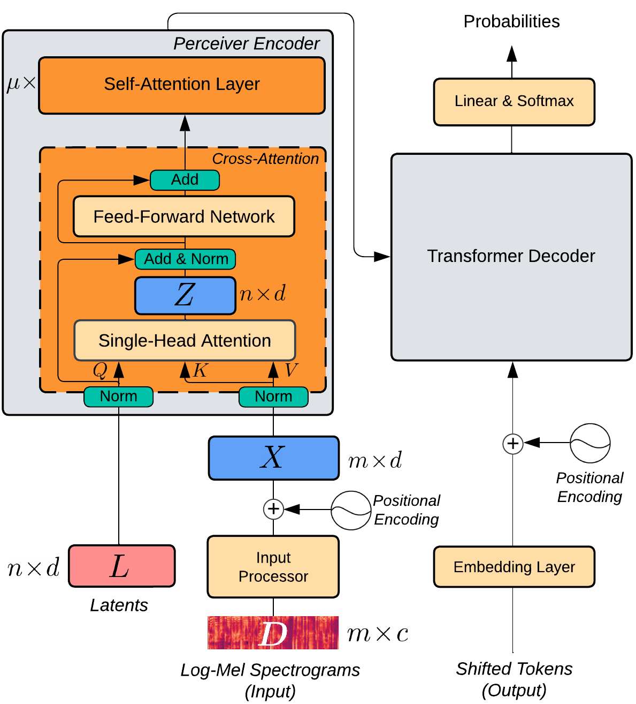
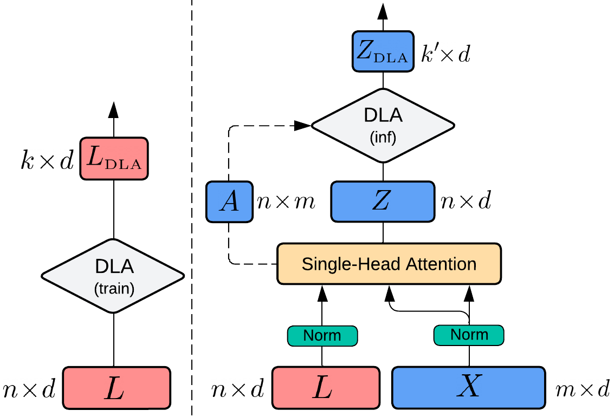

# Efficient Speech Translation with Dynamic Latent Perceivers

The pre-print of this research is available [here](https://arxiv.org/abs/2210.16264).

<em>
Transformers have been the dominant architecture for Speech Translation in recent years, achieving significant improvements in translation quality. Since speech signals are longer than their textual counterparts, and due to the quadratic complexity of the Transformer, a down-sampling step is essential for its adoption in Speech Translation. Instead, in this research, we propose to ease the complexity by using a Perceiver encoder to map the speech inputs to a fixed-length latent representation. Furthermore, we introduce a novel way of training Perceivers, with Dynamic Latent Access (DLA), unlocking larger latent spaces without any additional computational overhead. Speech-to-Text Perceivers with DLA can match the performance of a Transformer baseline across three language pairs in MuST-C. Finally, a DLA-trained model is easily adaptable to DLA at inference, and can be flexibly deployed with various computational budgets, without significant drops in translation quality.
</em>

S2T-Perceiver |  Dynamic Latent Access
:-------------------------:|:-------------------------:
  |  

## Setup

```bash
# path to clone this repo
export PERCEIVER_ROOT=...
# path to must-c data
export MUSTC_ROOT=...
# path to save experiment outputs
export OUTPUT_ROOT=...
```

Clone this repository to `$PERCEIVER_ROOT`:

```bash
git clone https://github.com/mt-upc/s2t_perceiver.git ${PERCEIVER_ROOT}
```

Create a conda environment using the `environment.yml` file and activate it:

```bash
conda env create -f ${PERCEIVER_ROOT}/environment.yml && \
conda activate s2t_perceiver && \
pip install --editable ${PERCEIVER_ROOT}/fairseq/
```

To prepare the MuST-C data follow the instructions [here](https://github.com/facebookresearch/fairseq/blob/main/examples/speech_to_text/docs/mustc_example.md#data-preparation). We used en-de (v2.0) and en-es, en-ru (v1.0).

## Train an S2T-Perceiver with Dynamic Latent Access (DLA-train)

To train the model first do the ASR pre-training step and then start the ST training with the pre-trained encoder.

- To train without DLA-train, set `$k_train = $n`.
- Example is for English-to-German (en-de).
- The suggested values for `base_update_freq` and `batch_size` are for an NVIDIA GeForce RTX 2080 Ti
, adjust them accordingly for other devices.
- For training with multiple devices make sure that `base_update_freq` is divisible by `n_gpus`.

```bash
# total number of latents
n=...
# number of latents for DLA-train
k_train=...
# language pair, for example: "en-de"
lang_pair=...

# ASR pre-training
bash ${PERCEIVER_ROOT}/scripts/train_perceiver_asr.sh $n $k_train

# ST training
bash ${PERCEIVER_ROOT}/scripts/train_perceiver_st.sh $lang_pair $n $k_train
```

## Evaluate an S2T-Perceiver with Dynamic Latent Access (DLA-inf)

To evaluate without DLA-inf, set `$k_inf = $n`.

```bash
# path to the trained model ($path_to_exp/ckpts)
path_to_exp=...
# language pair, for example: "en-de"
lang_pair=...
# number of latents for DLA-inf
k_inf=...

bash ${PERCEIVER_ROOT}/scripts/eval_perceiver_st.sh $path_to_exp $lang_pair $k_inf
```

## Citation

```bash
@misc{https://doi.org/10.48550/arxiv.2210.16264,
  doi = {10.48550/ARXIV.2210.16264},
  url = {https://arxiv.org/abs/2210.16264},
  author = {Tsiamas, Ioannis and Gállego, Gerard I. and Fonollosa, José A. R. and Costa-jussá, Marta R.},
  title = {Efficient Speech Translation with Dynamic Latent Perceivers},
  publisher = {arXiv},
  year = {2022}
}
```
